# pgctl screens

42 frames at 132×38. Generated by `tuikit frames`; edit the capture, not this file.

## Frames

### commands

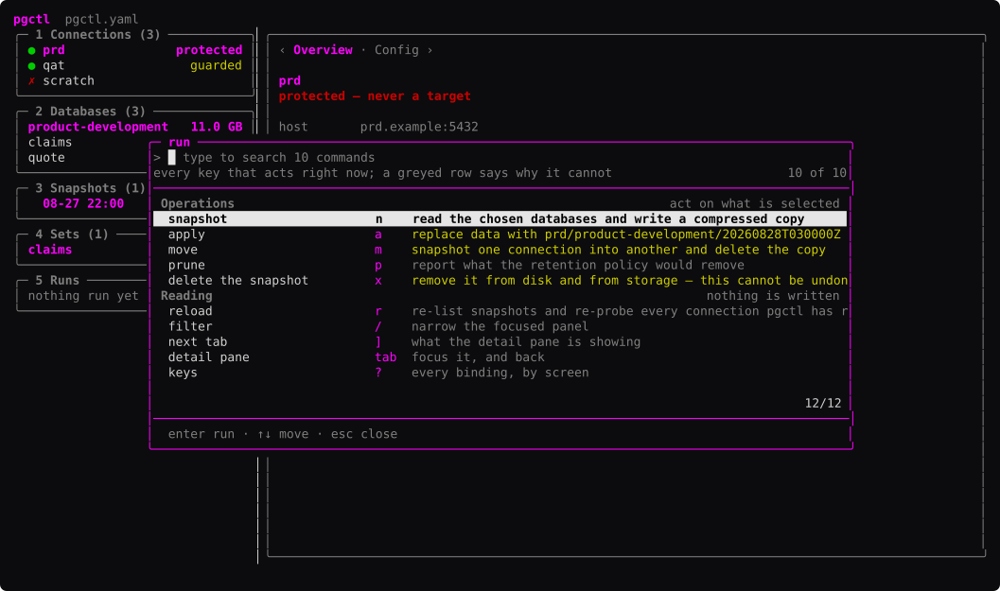

*fixture · 132×37*

### commands-query

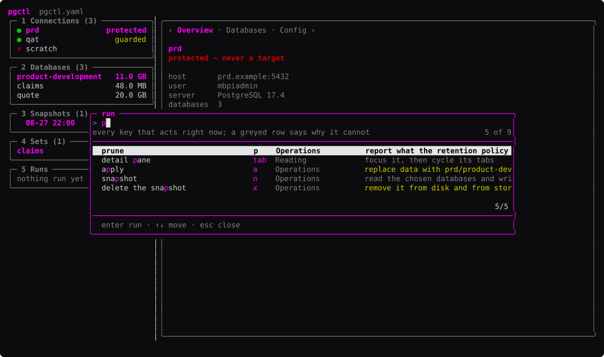

*fixture · 132×37*

### commands-refused

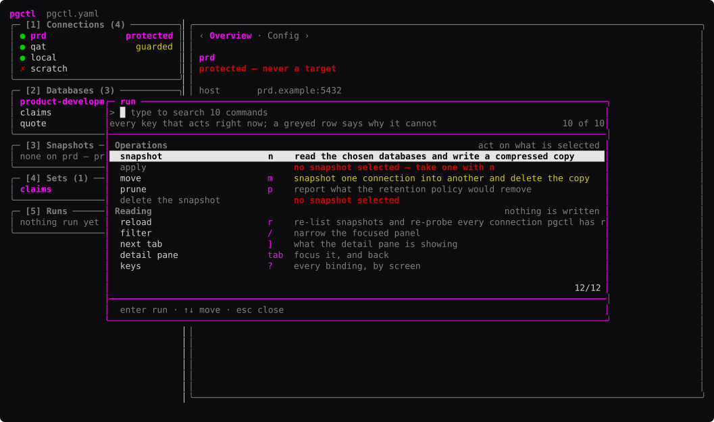

*fixture · 132×37*

### connections

*fixture · 132×37*

### databases

*fixture · 132×37*

### empty

*fixture · 132×37*

### filter

*fixture · 132×37*

### filter-matches-nothing

*fixture · 132×37*

### form-apply

*fixture · 132×37*

### form-apply-guarded

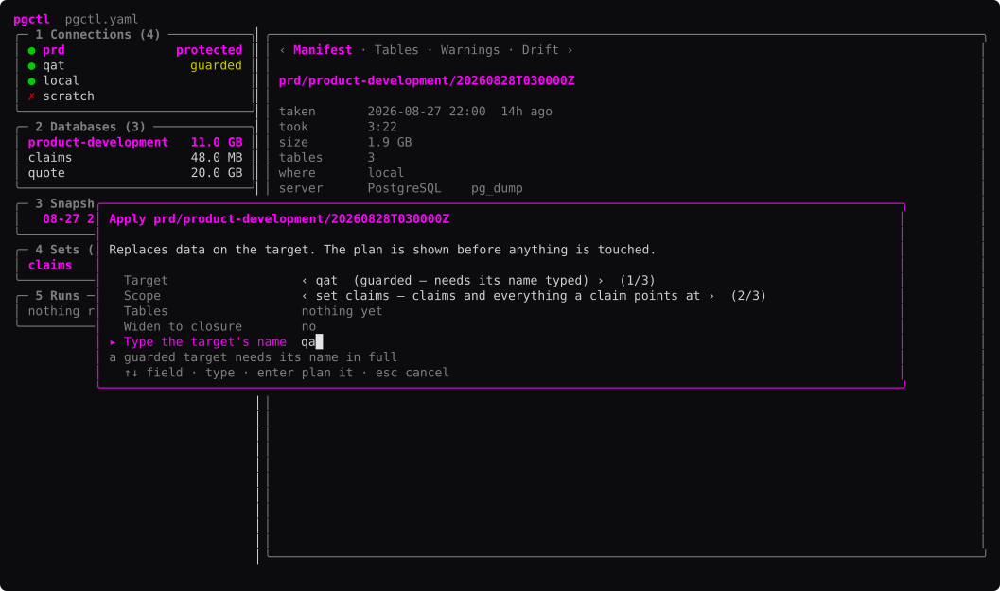

*fixture · 132×37*

### form-delete

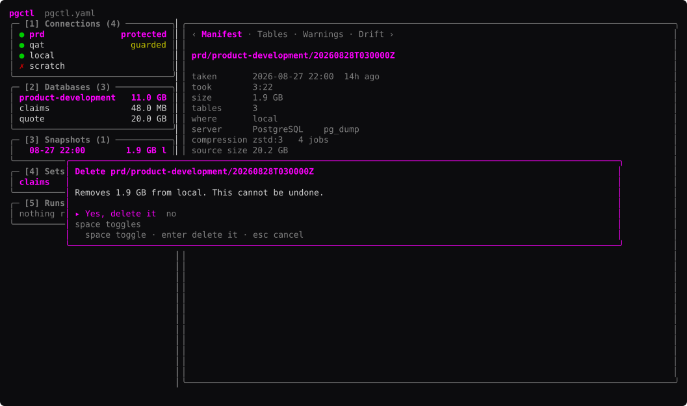

*fixture · 132×37*

### form-move

*fixture · 132×37*

### form-prune

*fixture · 132×37*

### form-snapshot

*fixture · 132×37*

### form-snapshot-refused

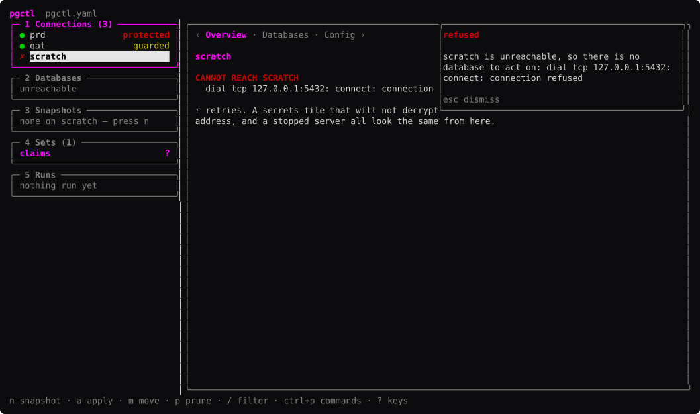

*fixture · 132×37*

### help

*fixture · 98×37*

### help-scrolled

*fixture · 98×37*

### leaving

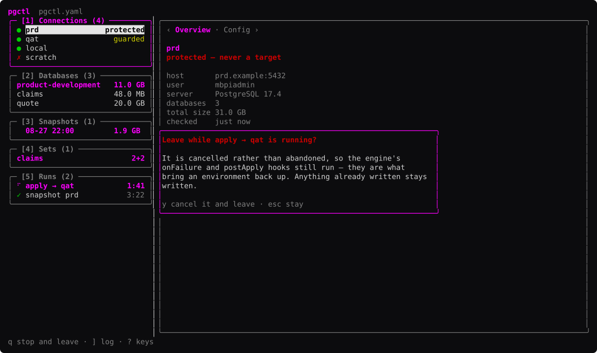

*fixture · 132×37*

### plan

*fixture · 132×37*

### plan-scrolled

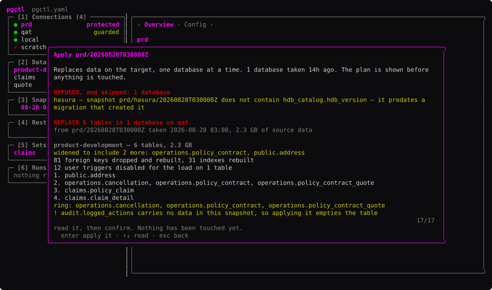

*fixture · 132×37*

### refused

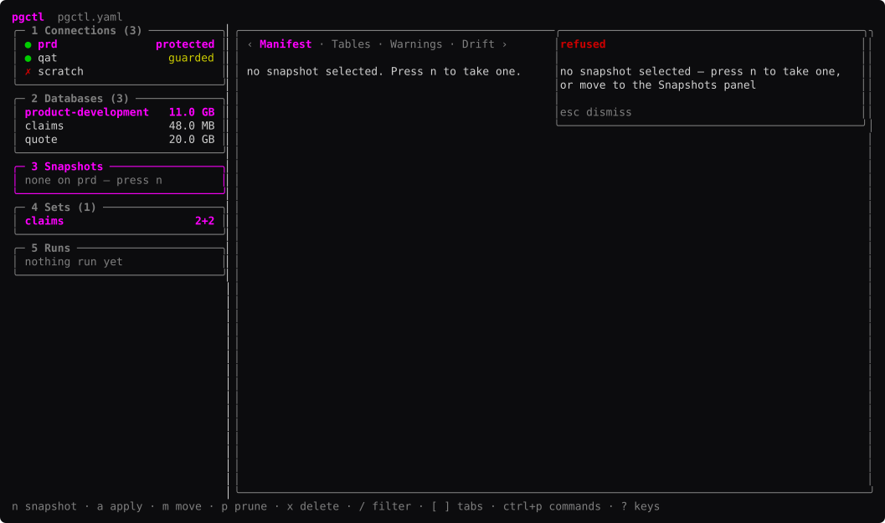

*fixture · 132×37*

### run-finished

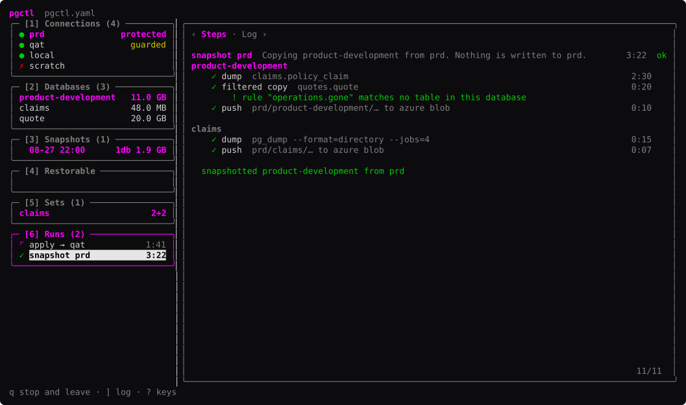

*fixture · 132×37*

### run-log

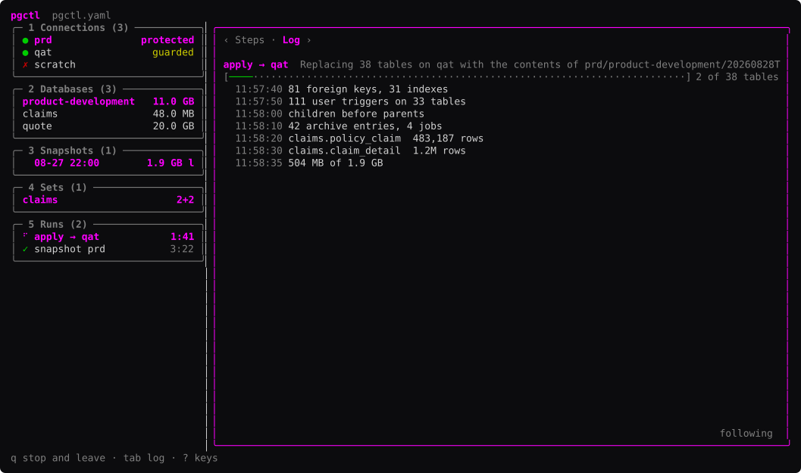

*fixture · 132×37*

### run-steps

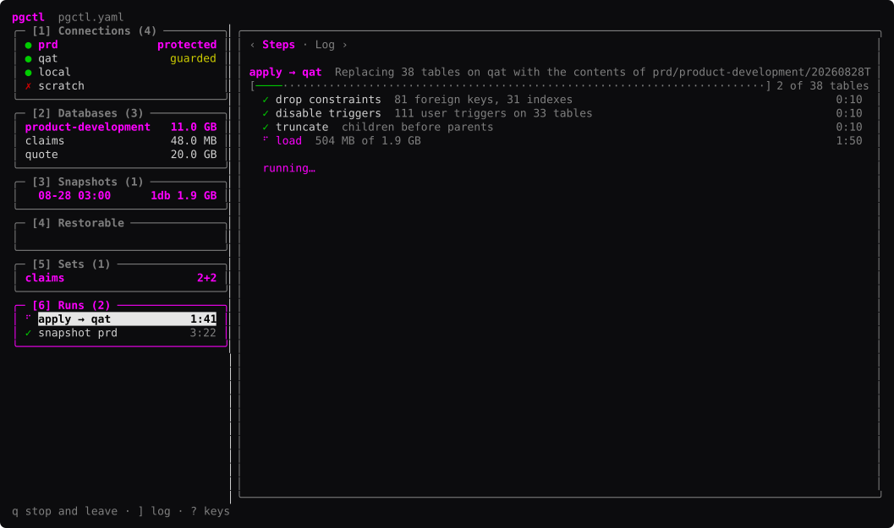

*fixture · 132×37*

### sets

*fixture · 132×37*

### snapshots

*fixture · 132×37*

### snapshots-grouped

*fixture · 132×37*

### tab-connections-config

*fixture · 132×37*

### tab-connections-databases

*fixture · 132×37*

### tab-connections-overview

*fixture · 132×37*

### tab-databases-foreign-keys

*fixture · 132×37*

### tab-databases-rules

*fixture · 132×37*

### tab-databases-tables

*fixture · 132×37*

### tab-databases-tables-scrolling

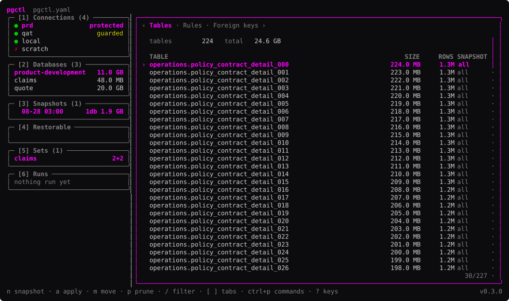

*fixture · 132×37*

### tab-sets-closure

*fixture · 132×37*

### tab-sets-load-order

*fixture · 132×37*

### tab-sets-members

*fixture · 132×37*

### tab-snapshots-drift

*fixture · 132×37*

### tab-snapshots-manifest

*fixture · 132×37*

### tab-snapshots-tables

*fixture · 132×37*

### tab-snapshots-warnings

*fixture · 132×37*

### unreachable

*fixture · 132×37*
