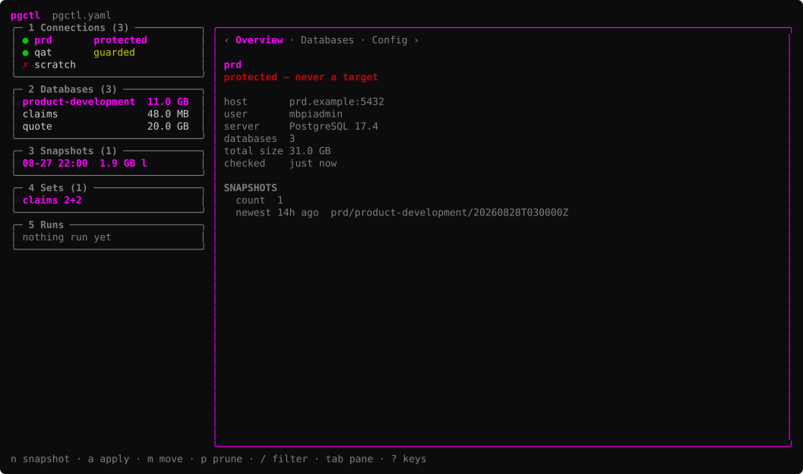
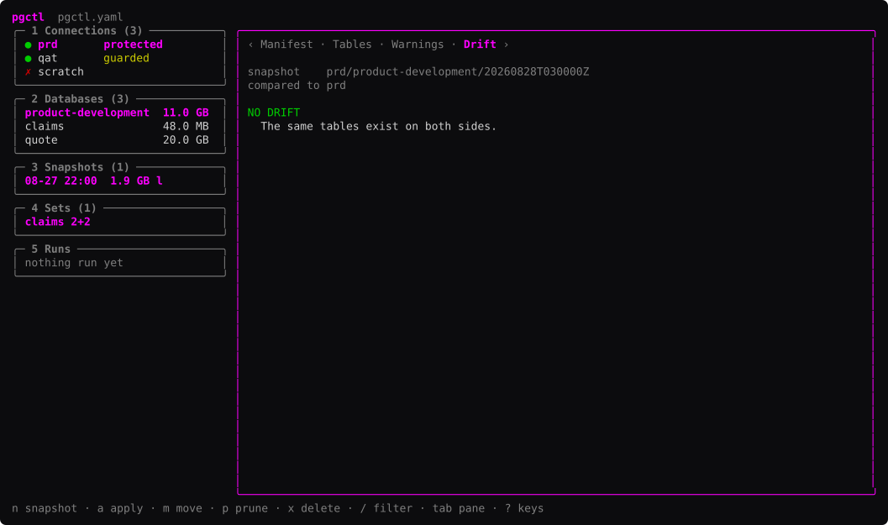
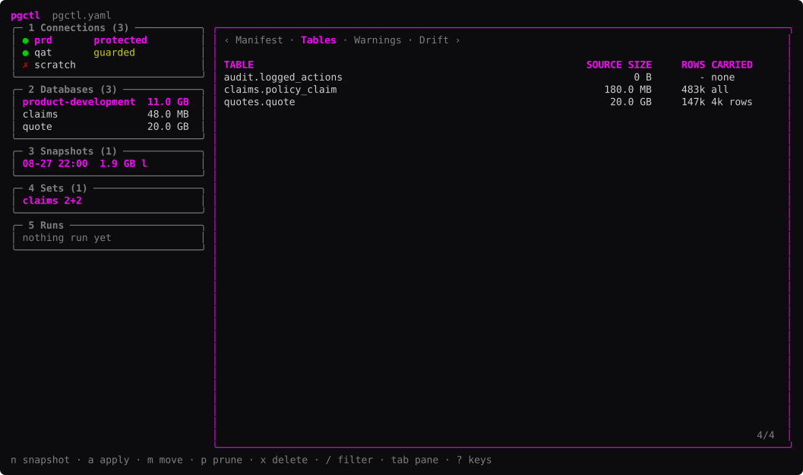
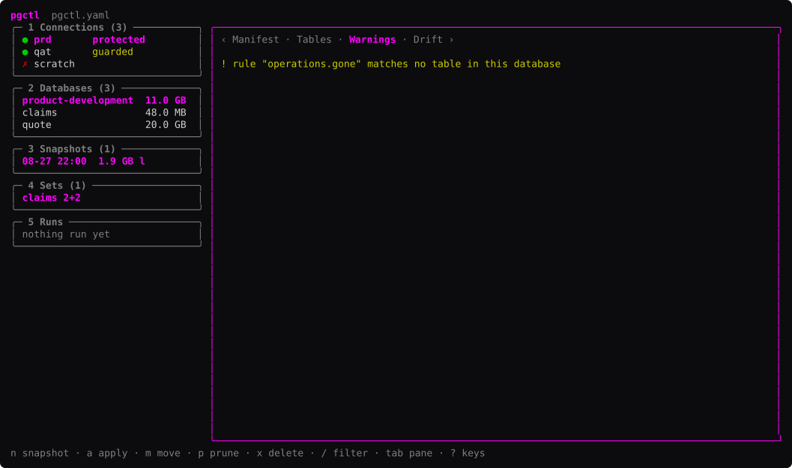

# pgctl screens

19 frames at 132×38. Generated by `tuikit frames`; edit the capture, not this file.

## Frames

### connections

*fixture · 132×37*

### databases

*fixture · 132×37*

### detail-pane

*fixture · 132×37*

### empty

*fixture · 132×37*

### filter

*fixture · 132×37*

### filter-matches-nothing

*fixture · 132×37*

### form-apply

*fixture · 132×37*

### form-move

*fixture · 132×37*

### form-prune

*fixture · 132×37*

### form-snapshot

*fixture · 132×37*

### help

*fixture · 103×37*

### help-scrolled

*fixture · 103×37*

### runs

*fixture · 132×37*

### sets

*fixture · 132×37*

### snapshot-drift

*fixture · 132×37*

### snapshot-tables

*fixture · 132×37*

### snapshot-warnings

*fixture · 132×37*

### snapshots

*fixture · 132×37*

### unreachable

*fixture · 132×37*
